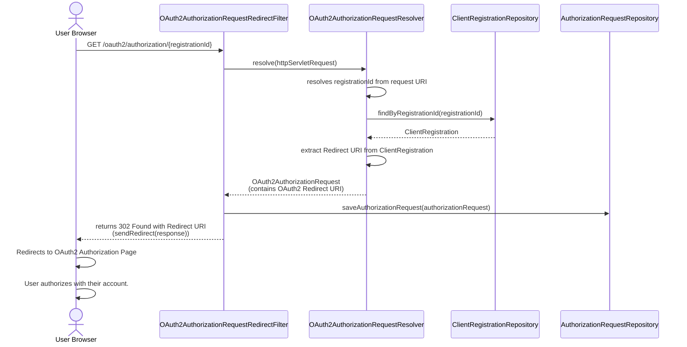
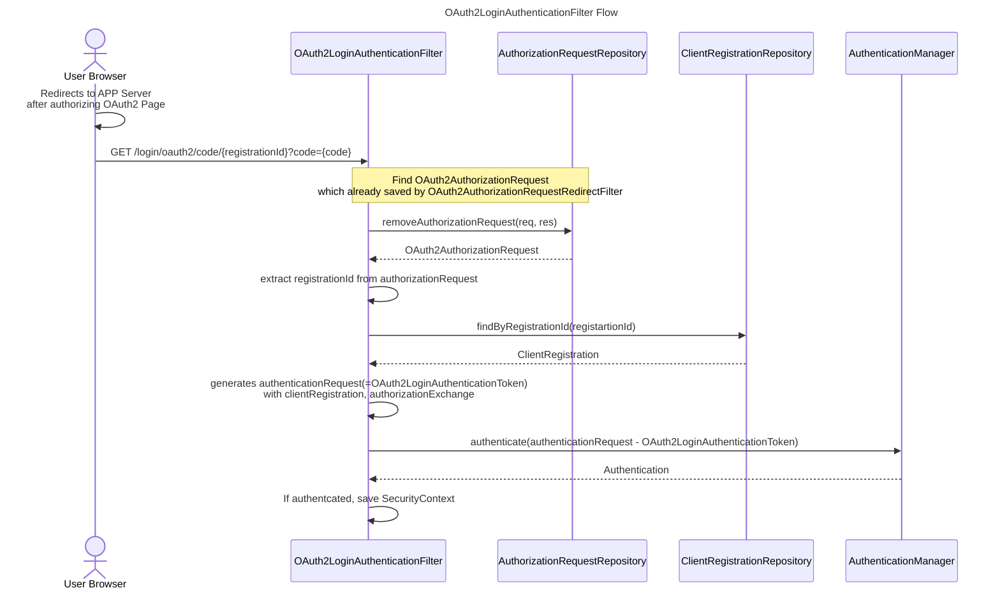
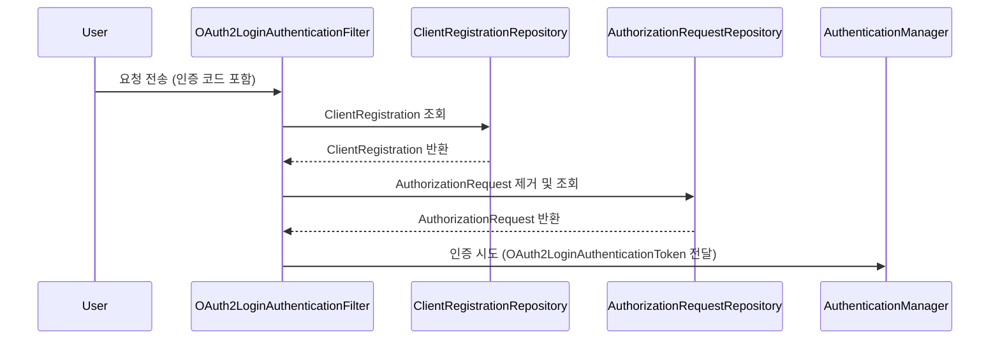
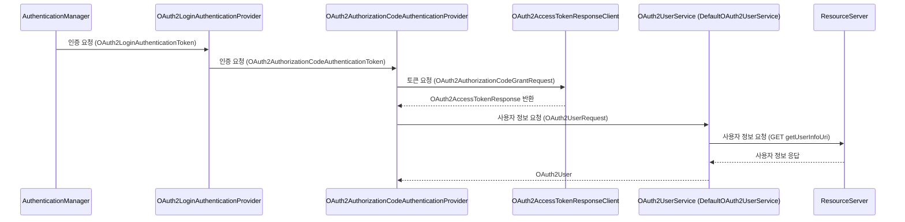
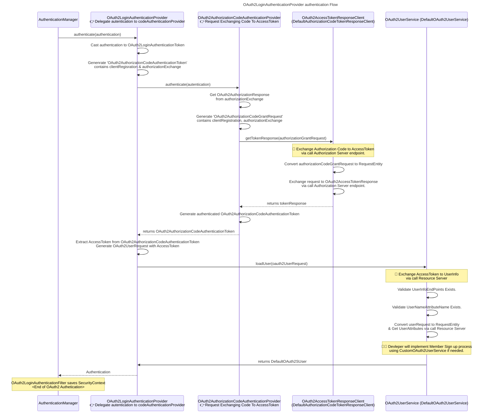
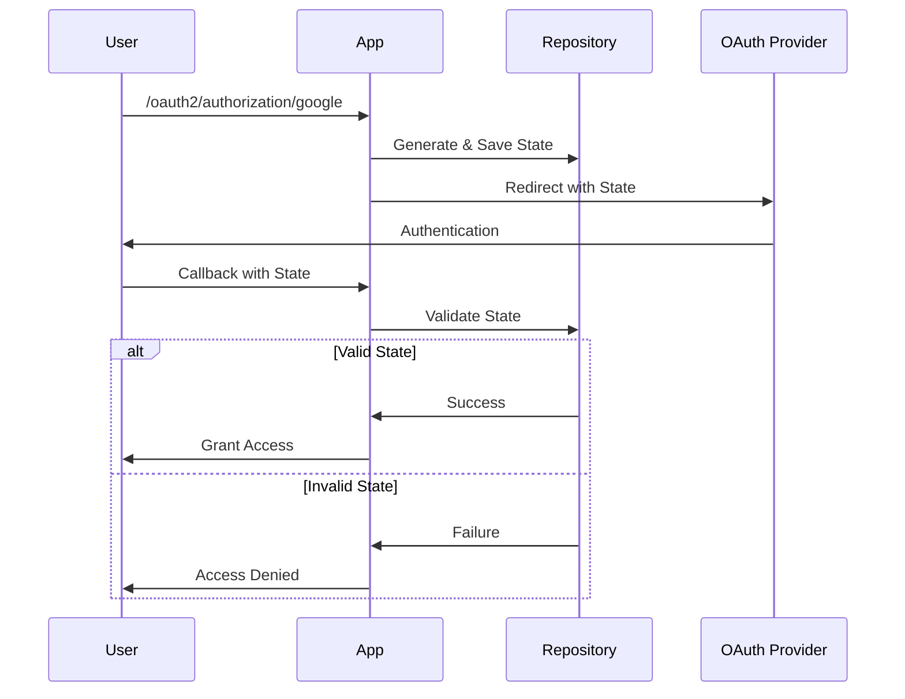
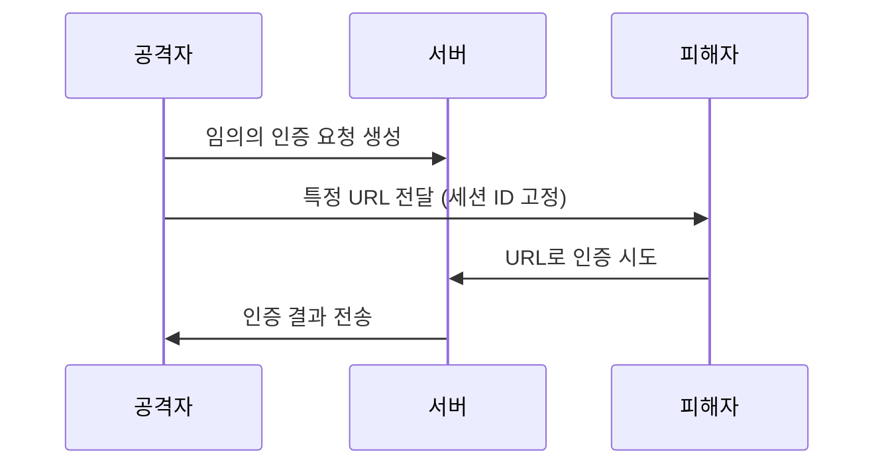

# 만들면서 배우는 Spring Security 2기 - OAuth 2.0 미션

## 1단계

### 🚀 1-1단계 - OAuth 2.0 Login

- [x] 깃헙 로그인 요청 시, 깃헙 로그인 페이지로 리다이렉트한다.
- [x] 깃헙에서 발급받은 승인 code를 이용하여 서버의 인증 처리를 진행한다.
  - [x] 발급 받은 code로 깃헙 액세스 토큰을 발급한다.
    - [x] 리다이렉트된 `/login/oauth2/code/github` 에서 code값을 추출하여 인증 토큰 생성 (OAuth2LoginFilter 구현)
    - [x] code를 인증 토큰에서 추출하여 액세스 토큰 발급을 요청하는 AuthenticationProvider 구현
  - [x] 발급 받은 깃헙 액세스 토큰으로 깃헙 사용자 리소스 조회를 요청한다.
  - [x] 조회한 사용자 리소스를 이용하여 로그인 후처리 작업을 진행한다.
    - [x] 기존 회원인 경우 세션에 로그인 정보를 저장한 뒤 "/"으로 리다이렉트.
    - [x] 신규 회원인 경우 회원 가입 처리 & 세션에 로그인 정보를 저장한 뒤 "/"으로 리다이렉트.

### 🚀 1-2단계 - 리팩터링 & OAuth 2.0 Resource 연동

- [x] 유저 정보 조회 책임을 `DefaultOAuth2UserService`로 위임
- [x] 구글 로그인 구현 전 사전 리팩토링
  - [x] OAuth2 인증 필터에서 인증 토큰에 provider 정보를 추가
    - [x] Request URI에서 provider 정보 추출
  - [x] OAuth2AuthenticationProvider에서 각 OAuth2 제공자에 맞게 액세스 토큰 취득
    - [x] GitHub Client 구현
  - [x] DefaultOAuth2UserService에서 각 OAuth2 제공자에 맞게 사용자 정보 조회
- [x] 구글 로그인 구현
  - [x] GoogleLoginRedirectFilter
  - [x] GoogleClient
    - [x] 코드를 이용한 액세스 토큰 발급
    - [x] 액세스 토큰을 이용한 사용자 정보 조회
- [x] 실제 UI로 통합 테스트 진행

## [1단계 피드백](https://github.com/next-step/spring-security-oauth2/pull/19#pullrequestreview-2652743249)

- [OAuth2 provider에 대한 직접적인 정보를 프로덕션 코드에 미노출(어떤 플랫폼을 사용할지는 추상화)](https://github.com/next-step/spring-security-oauth2/pull/19#discussion_r1976646965)
  - `provider`가 추가될 때 프로덕션 코드도 변경되어야할지에 대한 고민
- [OAuth2는 프로토콜. 플랫폼별로 동일한 스펙을 가지고 있다. 즉, 플랫폼마다 각각의 구현체를 따로 둘 필요는 없음.](https://github.com/next-step/spring-security-oauth2/pull/19#discussion_r1976648478)

### 피드백 적용

- [x] OAuth2 제공자가 추가되어도 프로덕션 코드는 변경 없도록 환경변수를 추상화하여 관리
- [x] OAuth2AuthorizationRequestRedirectFilter 필터 구현

## 2단계

### 2-1: 리다이렉트 필터

> 주요 클래스
> - OAuth2AuthorizationRequestResolver
> - AuthorizationRequestRepository
> - OAuth2AuthorizationRequest
> - ClientRegistrationRepository

- [x] ClientRegistrationRepository 구현
  - [x] <RegistrationId, ClientRegistration>를 담는 일급 컬렉션 InMemoryClientRegistrationRepository 구현
  - [x] InMemoryClientRegistrationRepository 빈 등록 시 ClientPrlaperties 주입 받아 초기화
- [x] OAuth2AuthorizationRequestResolver 구현
  - [x] OAuth2AuthorizationRequestResolver 빈 등록 시 ClientRegistrationRepository 주입 받아 초기화
- [x] AuthorizationRequestRepository 구현
  - [x] HttpSession에 OAuth2AuthorizationRequest를 저장

### 2-2: OAuth 인증 필터

> 주요 클래스
> - ClientRegistrationRepository
> - OAuth2AuthorizedClientRepository
> - AuthorizationRequestRepository
> - AuthenticationManager
> - HttpSessionSecurityContextRepository
> - Converter와 Converter<OAuth2LoginAuthenticationToken, OAuth2AuthenticationToken>

- [x] OAuth2LoginAuthenticationFilter 구현
  - [x] ClientRegistrationRepository에서 ClientRegistration 조회
  - [x] AuthorizationRequestRepository에서 AuthorizationRequest 조회
  - [x] OAuth2LoginAuthenticationToken 생성 및 AuthenticationManager로 인증 시도
- [x] OAuth2LoginAuthenticationProvider 구현
  - [x] OAuth2AuthorizationCodeAuthenticationToken 생성 
  - [x] OAuth2AuthorizationCodeAuthenticationProvider로 인증 위임.
  - [x] OAuth2UserService를 이용하여 사용자 정보 조회.
    - [x] DefaultOAuth2UserService에서 사용자 정보 조회(Google Client, GitHub Client 삭제)
- [x] OAuth2AuthorizationCodeAuthenticationProvider 구현
  - [x] OAuth2AccessTokenResponseClient를 이용하여 액세스 토큰 발급.
    - [x] OAuth2AccessTokenResponseClient 구현
- [ ] 깨지는 HTTP Session 관련 테스트 수정

## 2단계 피드백

---

# OAuth2 인증 플로우 참고

## OAuth2 인증 리다이렉트 

## OAuth2LoginAuthenticationFilter 플로우

### OAuth2LoginAuthenticationProvider 플로우

## OAuth2 인증에서 state값 활용 플로우

